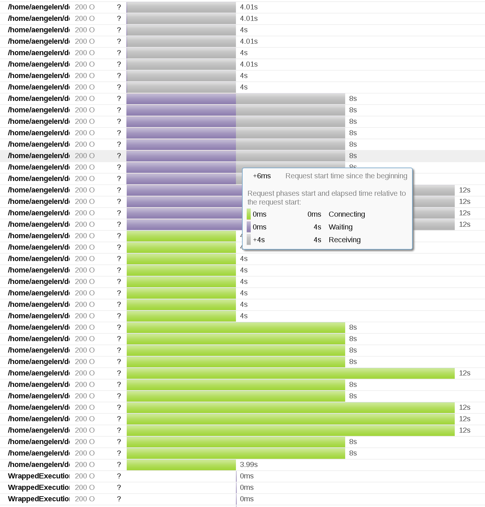

# ectrace

Wraps a Scala ExecutionContext to collect some statistics.

Experiment/WiP stage

## Example

Run the example script at [TestMain.sc](example/TestMain.sc) (with 
[Ammonite](http://www.lihaoyi.com/Ammonite/)).

This example script schedules a number of `Future`s with a body that sleeps
(blocking the thread) for 4 seconds. It produces a
[timeline.data](example/timeline.data) with the collected timing information:

```
1484400129982 1484400129982 1484400129982 1484400129982 WrappedExecutionContext.scala:32
1484400129982 1484400129982 1484400129982 1484400129982 WrappedExecutionContext.scala:32
(...)
1484400117982 1484400117982 1484400121980 1484400125981 /home/aengelen/dev/ectrace/example/TestMain.sc:14
1484400117982 1484400117982 1484400121980 1484400125980 /home/aengelen/dev/ectrace/example/TestMain.sc:14
1484400117982 1484400117982 1484400121980 1484400125980 /home/aengelen/dev/ectrace/example/TestMain.sc:14
1484400117982 1484400117982 1484400121980 1484400125980 /home/aengelen/dev/ectrace/example/TestMain.sc:14
1484400117981 1484400117981 1484400117981 1484400121982 /home/aengelen/dev/ectrace/example/TestMain.sc:14
1484400117981 1484400117981 1484400117981 1484400121981 /home/aengelen/dev/ectrace/example/TestMain.sc:14
1484400117981 1484400117981 1484400117981 1484400121981 /home/aengelen/dev/ectrace/example/TestMain.sc:14
1484400117980 1484400117980 1484400117980 1484400121981 /home/aengelen/dev/ectrace/example/TestMain.sc:14
1484400117980 1484400117980 1484400117980 1484400121980 /home/aengelen/dev/ectrace/example/TestMain.sc:14
1484400117980 1484400117980 1484400117980 1484400121980 /home/aengelen/dev/ectrace/example/TestMain.sc:14
1484400117979 1484400117979 1484400117979 1484400121980 /home/aengelen/dev/ectrace/example/TestMain.sc:14
1484400117977 1484400117977 1484400117979 1484400121979 /home/aengelen/dev/ectrace/example/TestMain.sc:14
```

This can be converted to [HAR](http://www.softwareishard.com/blog/har-12-spec/) format:

    amm -s ../timeline2har.sc < timeline.data > timeline.har

yielding [timeline.har](example/timeline.har) which can be visualized with for
example the [HAR Viewer](http://www.softwareishard.com/blog/har-viewer/):


